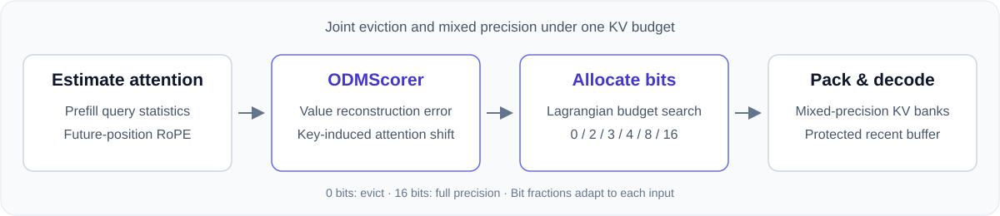

<h1 align="center">ODM-KV</h1>
<p align="center"><b>KV Cache Compression via Attention Output Distortion Minimization</b></p>
<p align="center">
  <a href="#overview">Overview</a> ·
  <a href="#installation">Installation</a> ·
  <a href="#quick-start">Quick start</a> ·
  <a href="#evaluation">Evaluation</a> ·
  <a href="#code-structure">Code</a>
</p>

<p align="center"></p>

## Overview

**ODM-KV jointly chooses which KV entries to evict and how precisely to store the rest.** Given a target average bit budget, it estimates each entry's contribution to attention-output distortion and assigns a precision from **{0, 2, 3, 4, 8, 16}**. Here, 0 means eviction and 16 means retaining the model's full cache precision.

- **Output-aware allocation.** `ODMScorer` accounts for both value reconstruction error and the attention-weight changes caused by key error.
- **An input-dependent precision mixture.** Eviction and bit-width fractions follow from the budget allocation; no fixed token ratios are required.
- **Reference and native implementations.** A readable PyTorch path supports quality evaluation, while the CUDA backend packs the cache and attends directly to its mixed-precision storage.

The implementation targets Llama-3.1 and Qwen3 decoder architectures. The [method notes](docs/method.md) explain the score, allocation, and cache policy.

## Installation

Use Python 3.10+ and install from the repository root:

```bash
python -m pip install -e .
```

The package pins **PyTorch 2.8.0** and **Transformers 5.0.0**. Install a CUDA build of PyTorch on GPU machines. Model weights are loaded through Hugging Face; gated models require access to their weights.

For benchmark evaluation and tests:

```bash
python -m pip install -e ".[eval,test]"
```

The **native backend** additionally requires Linux, an NVIDIA GPU with BF16 support, Triton, and FlashAttention 2. Install FlashAttention after PyTorch:

```bash
python -m pip install ninja packaging
python -m pip install "flash-attn>=2.7,<3" --no-build-isolation
```

Triton is provided by the supported Linux CUDA PyTorch distribution. See [backend support](docs/backends.md) for the native execution constraints.

## Quick start

Run a small synthetic long-context generation example, with no benchmark dataset download:

```bash
python examples/generate.py --target-avg-bits 2.0
```

Select another model or use the native packed-cache backend:

```bash
python examples/generate.py --model Qwen/Qwen3-8B --target-avg-bits 2.0
python examples/generate.py --backend native --target-avg-bits 2.0
```

Pass `--prompt` to supply your own input and `--max-new-tokens` to set the generation length. Inputs shorter than the protected sink and recent window receive little or no compression.

### Use ODM-KV in Python

```python
import torch
from transformers import AutoModelForCausalLM, AutoTokenizer
from kvquant import ODMPress

model_id = "meta-llama/Meta-Llama-3.1-8B-Instruct"
tokenizer = AutoTokenizer.from_pretrained(model_id)
model = AutoModelForCausalLM.from_pretrained(
    model_id, dtype=torch.bfloat16, attn_implementation="sdpa",
).to("cuda").eval()

prompt = "Your long context and question go here."
inputs = tokenizer(prompt, return_tensors="pt").to("cuda")
with torch.inference_mode(), ODMPress(target_avg_bits=2.0)(model):
    output = model.generate(**inputs, max_new_tokens=128, do_sample=False)
print(tokenizer.decode(output[0, inputs.input_ids.shape[1]:], skip_special_tokens=True))
```

`ODMPress` is the **reference implementation**: it reconstructs quantized K/V into a dense cache for attention. Use the native example for physical compressed-cache execution; reference-path memory and timing do not represent native performance.

### Set the budget

`target_avg_bits` controls the allocation over the non-sink prefill entries of each layer. For example, **1.0 is an average budget**, achieved by mixing eviction with retained precisions; it does not select a 1-bit quantizer.

| Setting | Default | Meaning |
| --- | --- | --- |
| `target_avg_bits` | `2.0` | Target average allocation budget |
| `sink_tokens` | `4` | Initial tokens retained at full precision |
| `buffer_size` | `128` | Protected prefill tail and decode flush interval |
| `epsilon` | `0.01` | Attention smoothing in `ODMScorer` |
| `n_future_positions` | `512` | Future-position window used to estimate attention |

Both backends retain generated tokens at full precision until the decode buffer fills, then allocate a fresh budget over the nonzero bit levels. With eviction disabled for generated tokens, targets at or below 2 bits assign that buffer to 2 bits.

**Allocation bits are not physical cache bytes.** Protected tokens, vector norms, indexing metadata, packing, and reserved capacity contribute additional storage. The [backend notes](docs/backends.md) describe this distinction.

## Method

For each entry $i=(\text{layer},\text{KV head},\text{token})$, the implemented score is

$$
s_i=(\hat p_i+\eta)^2
\left(\|v_i\|^2+\frac{\|k_i\|^2}{d}\|v_i-\bar o\|^2\right),
\qquad \bar o=\sum_j\hat p_jv_j.
$$

Here $\hat p_i$ is estimated attention, $\eta$ is the smoothing parameter, and $d$ is the head dimension. The two terms measure sensitivity to value and key errors, respectively. The native prefill scorer reuses attention's projected Q/K/V.

For a bit price $\lambda$, entries independently select

$$
b_i^*(\lambda)=\arg\min_{b\in\{0,2,3,4,8,16\}}
\left[s_i\tilde\varepsilon(b)+\lambda b\right].
$$

The quantized error curve is calibrated for TurboQuant-MSE; the eviction cost is 0.5 and the full-precision cost is zero. Binary search adjusts $\lambda$ toward the budget, followed by a discrete budget repair. The repair is a heuristic, so the final allocation is not claimed to be the exact integer optimum.

## Evaluation

Install the `eval` dependencies, then run the reference implementation on LongBench or RULER:

```bash
# LongBench: QASPER, 5% of examples
python eval_longbench.py --config configs/odmkv.yaml \
  --tasks qasper --fraction 0.05 --output results/qasper.json

# RULER: one retrieval task at 4K context
python eval_ruler.py --config configs/odmkv.yaml \
  --tasks niah_multikey_3 --context_length 4096 \
  --fraction 0.05 --output results/ruler4k.json
```

Edit `target_avg_bits` in [configs/odmkv.yaml](configs/odmkv.yaml) to change the budget. The larger [LongBench](configs/exp_longbench.yaml) and [RULER](configs/exp_ruler.yaml) configurations also include an uncompressed FullKV reference. These commands are runnable examples; reproducing a particular experiment requires its model, task set, context length, and sampling settings.

## Code structure

```text
kvquant/
  scorer.py              ODMScorer: analytical output-distortion score
  allocator.py           Error calibration and joint bit allocation
  press.py               Reference model integration
  tq_backend.py          TurboQuant-MSE and quantization primitives
  tq_adaptive_backend.py Reference mixed-precision cache
  runtime/               Native packed storage, Triton kernels, CUDA graphs
examples/generate.py     Minimal generation example
benchmark/               LongBench and RULER evaluation
configs/                 Minimal and benchmark configurations
tests/                   Numerical and model-integration tests
```

Start with `ODMScorer.score_with_attn` and `optimal_scores_to_bits` to read the core method. All public entry points use `ODMScorer`; alternative scoring methods and experimental allocation policies are excluded.

## Tests

```bash
python -m pytest tests -q
```

CPU tests use synthetic tensors and small randomly initialized Llama/Qwen3 models; no model weights are downloaded. CUDA-specific tests skip when CUDA is unavailable. Native kernel correctness requires running those tests on a compatible GPU.

## Acknowledgements

The evaluation workflow and attention utilities build on [NVIDIA kvpress](https://github.com/NVIDIA/kvpress). Quantization uses TurboQuant-MSE with Lloyd–Max codebooks. See [third-party notices](THIRD_PARTY_NOTICES.md).

## License

ODM-KV contributions are released under the [MIT License](LICENSE). Adapted third-party components retain their original notices and license terms.
