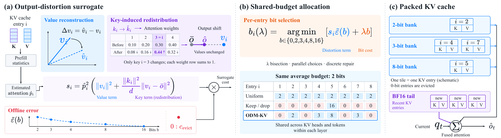

<h1 align="center">ODM-KV</h1>
<p align="center"><b>KV Cache Compression via Attention Output Distortion Minimization</b></p>

<p align="center"><a href="assets/overview.pdf"></a></p>

**ODM-KV jointly optimizes token eviction and KV-cache precision under an average-bit budget.** Each KV entry receives a bit-width from $\mathcal{B}=\{0,2,3,4,8,16\}$, where $0$ means eviction and $16$ preserves full precision.

- 🎯 **Output-aware scoring** accounts for both value reconstruction and key-induced attention redistribution.
- ⚖️ **Joint allocation** determines which entries to retain and their precision, without fixed eviction ratios.
- ⚡ **Packed-cache attention** reads mixed-bit K/V directly, with a BF16 tail for recent tokens.

## 🔬 Method

**① Output-distortion score.** For an entry $i$, `ODMScorer` estimates future attention $\hat p_i$ and its weighted output $\bar o=\sum_j\hat p_jv_j$:

$$
\boxed{
s_i=\hat p_i^2\left(
\underbrace{\|v_i\|^2}_{\text{value reconstruction}}
+\underbrace{\frac{\|k_i\|^2}{d}\|v_i-\bar o\|^2}_{\text{key-induced redistribution}}
\right)
}
$$

Here $d$ is the head dimension. The implementation smooths $\hat p_i^2$ to $(\hat p_i+\eta)^2$ with $\eta=0.01$.

**② Joint eviction and quantization.** With a calibrated distortion curve $\tilde\varepsilon(b)$, precision allocation minimizes the additive surrogate:

$$
\min_{\{b_i\}\in\mathcal{B}^N}\;\sum_i s_i\tilde\varepsilon(b_i)
\qquad\text{s.t.}\qquad
\frac{1}{N}\sum_i b_i\le\bar b.
$$

For a bit price $\lambda\ge0$, each entry selects

$$
b_i^\star(\lambda)=\arg\min_{b\in\mathcal{B}}
\left\{\underbrace{s_i\tilde\varepsilon(b)}_{\text{distortion cost}}
+\underbrace{\lambda b}_{\text{bit cost}}\right\}.
$$

We use TurboQuant-MSE calibration for retained quantized entries, $\tilde\varepsilon(0)=c_{\mathrm{evict}}=0.5$, and $\tilde\varepsilon(16)=0$. Bisection on $\lambda$ and a discrete repair heuristic approach the target budget.

## 🛠️ Installation

Python 3.10+ · PyTorch 2.8.0 · Transformers 5.0.0. For native CUDA execution, use Linux, CUDA 12+, and an Ampere-or-newer NVIDIA GPU.

```bash
pip install -r requirements.txt
pip install flash-attn==2.8.3 --no-build-isolation
```

[FlashAttention 2.8.3](https://github.com/Dao-AILab/flash-attention/releases/tag/v2.8.3) provides PyTorch 2.8 / CUDA 12 wheels.

## 🚀 Quick start

Run the synthetic long-context example with Llama-3.1 or Qwen3:

```bash
python examples/generate.py --target-avg-bits 2.0
python examples/generate.py --model Qwen/Qwen3-8B --target-avg-bits 2.0

# Native packed-cache execution
python examples/generate.py --backend native --target-avg-bits 2.0
```

## 📊 Evaluation

Run the reference implementation on LongBench or RULER:

```bash
# LongBench
python eval_longbench.py --config configs/odmkv.yaml \
  --tasks qasper --fraction 0.05 --output results/qasper.json

# RULER
python eval_ruler.py --config configs/odmkv.yaml \
  --tasks niah_multikey_3 --context_length 4096 \
  --fraction 0.05 --output results/ruler4k.json
```

Set the model and `target_avg_bits` in [configs/odmkv.yaml](configs/odmkv.yaml).

## 🙏 Acknowledgements

Built on [NVIDIA kvpress](https://github.com/NVIDIA/kvpress) and TurboQuant-MSE with Lloyd–Max codebooks. See [third-party notices](THIRD_PARTY_NOTICES.md).

## 📄 License

[MIT](LICENSE). Adapted third-party components retain their original licenses.
